# Procedural Jellyfish

## Result
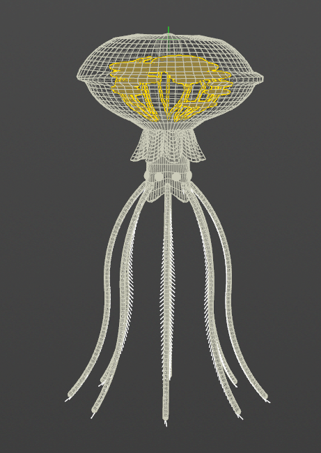

Link to animation:
https://youtu.be/IYOGoNA7XNY

## Inspiration
Ventgarden from Subnautica:
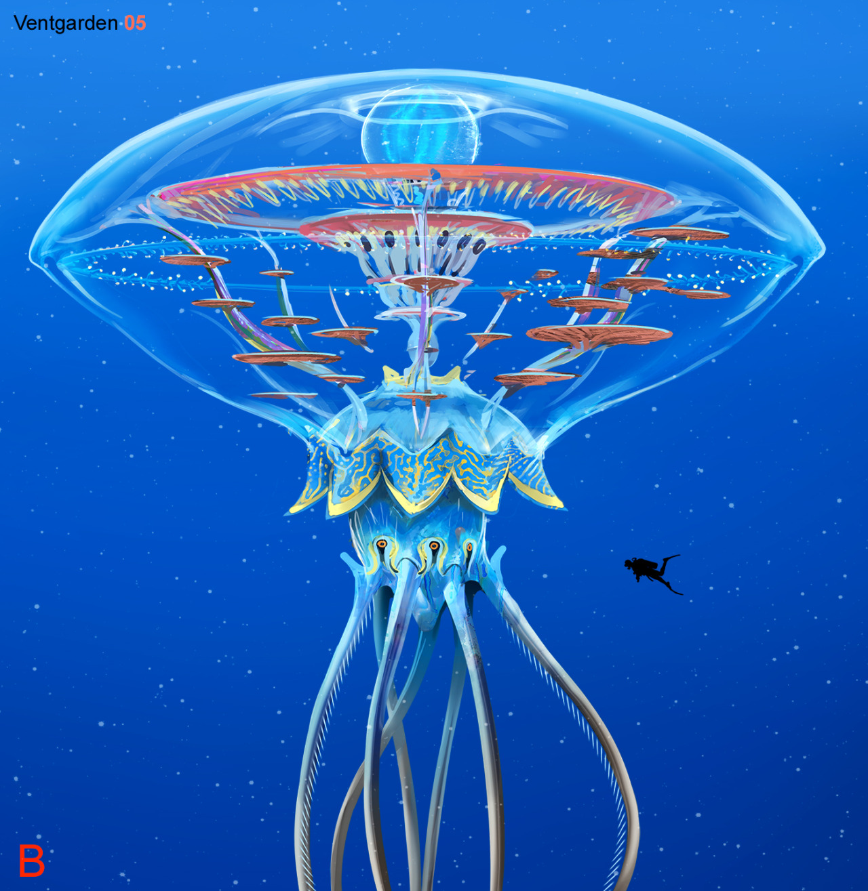

## Components 
### Veins -> Interior Forest
I turned the vein part of our template into an internal forest like the reference jellyfish!
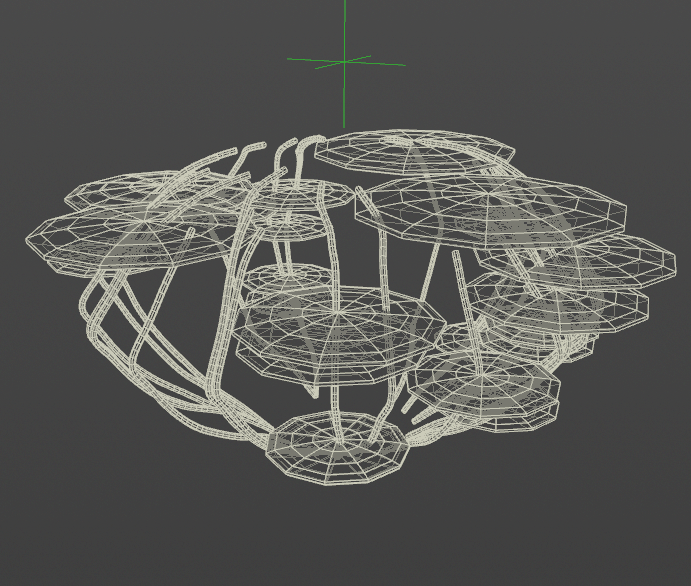

### Animated Eye
Eyes on the side of the jellyfish. they blink every few seconds!!

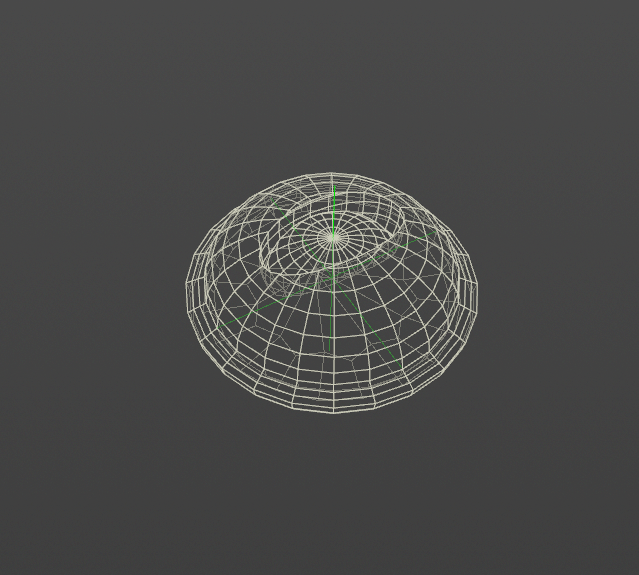
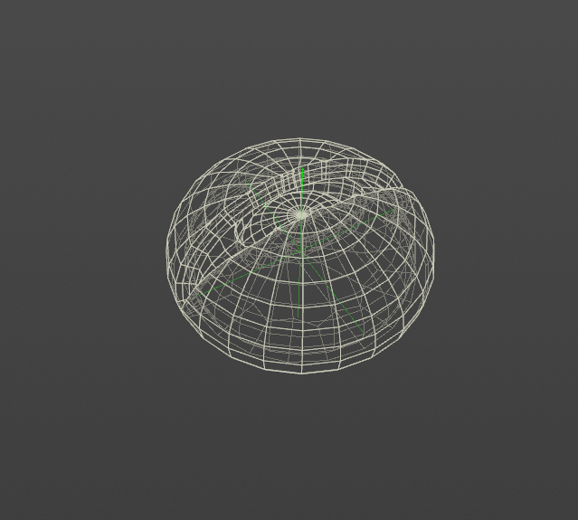

### Arms
Since the reference has very simple legs, I also implemented the required arms in the same file in case there are hw requirement concerns ^^);

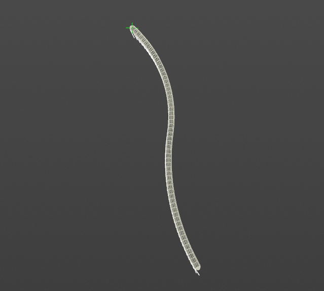
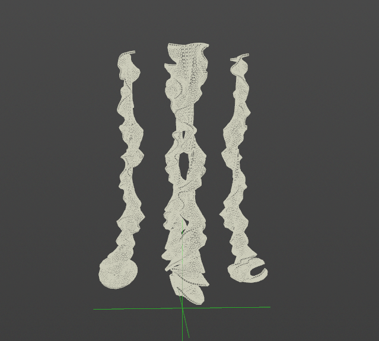

### Body
This one is coded using the same logic as the flower lab code :]

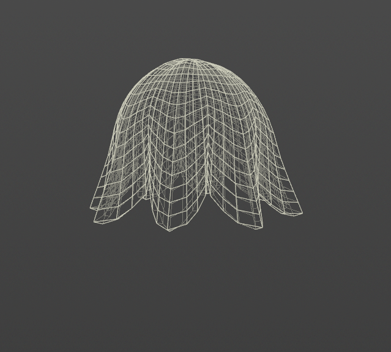

Lower body is similar, then with all the components attached. 
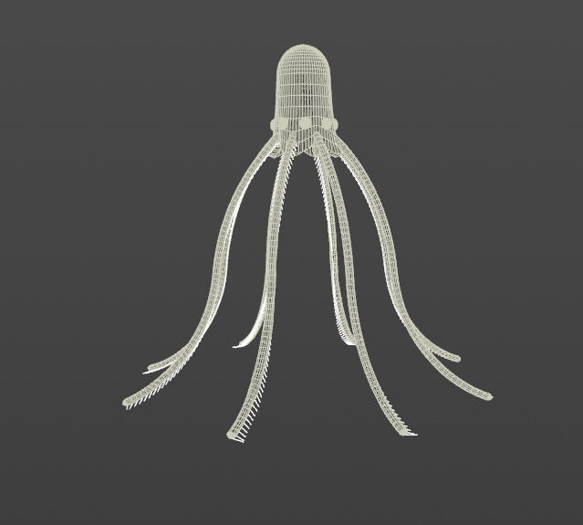

These components are variable count! 
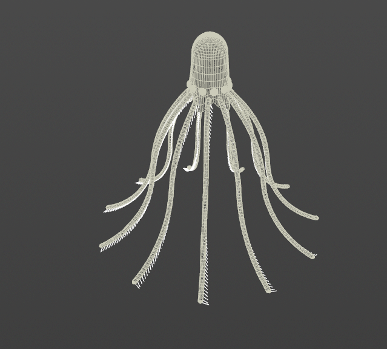
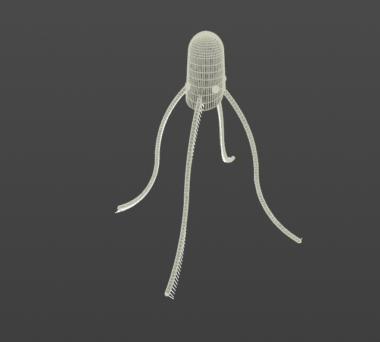

### Bell
Animated bell, created by using bridge node to connect cylinders
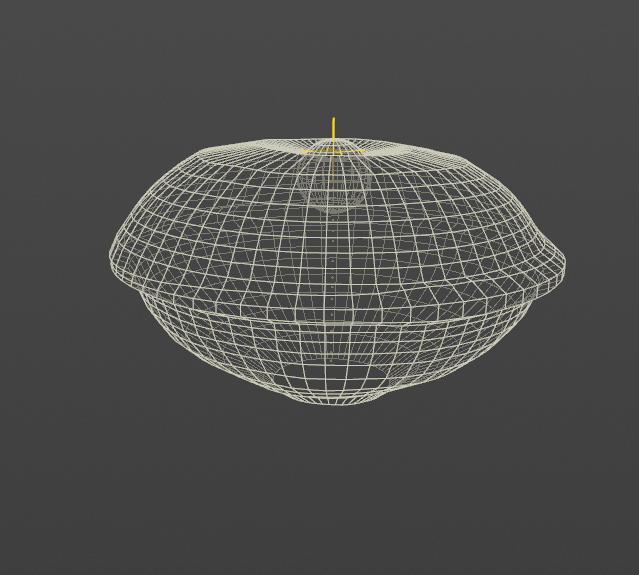

due to time reason this readme is be a bit simple ^^);
feel free to let me know if there are any questions!